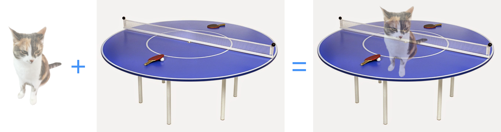
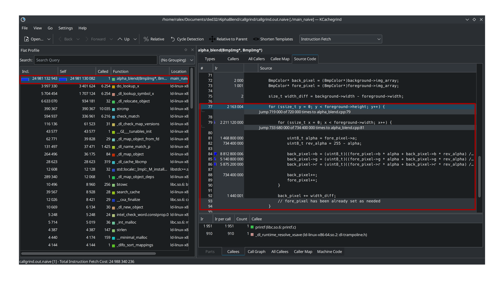

# Содержание

1. [Alpha blending](#alpha-blending)
    1. [Формат `bmp`](#формат-bmp)
    2. [Оптимизации и профилирование](#оптимизации-и-профилирование)
        1. [Варианты программы:](#варианты-программы)
            1. [1. `base` - базовая версия без оптимизаций](#1-base---базовая-версия-без-оптимизаций)
            2. [2. `vector` - векторизация при помощи `AVX2`](#2-vector---векторизация-при-помощи-avx2)
            3. [3. `vector + aligning` - предыдущее + выравнивание памяти](#3-vector--aligning---предыдущее--выравнивание-памяти)
            4. [4. `vector + aligning + inaccurate division by 255` - предыдущее + неточное деление на 255](#4-vector--aligning--inaccurate-division-by-255---предыдущее--неточное-деление-на-255)
        2. [Результаты измерений](#результаты-измерений)
            1. [`KCachegrind` для базового варианта](#kcachegrind-для-базового-варианта)
            2. [`KCachegrind` для `vector + aligning + inaccurate division by 255`](#kcachegrind-для-vector--aligning--inaccurate-division-by-255)
            3. [Сравнение результатов](#сравнение-результатов)
        3. [Вывод](#вывод)
2. [Источники и инструменты](#источники-и-инструменты)
3. [Благодарности](#благодарности)

# Alpha blending

Смешение двух картинок: на фон наклаывается изображение с учётом его прозрачности

## Формат `bmp`

Несколько слов об этом формате (только важные для нас пункты):

- В начале находятся две структуры данных:
    - `BITMAPFILEHEADER`:
        - `type` - сигнатура (должно быть "BM")
        - `size` - размер всего файла
        - `offset` - смещение массива пикселей от начала файла
    - `BITMAPINFOHEADER`:
        - `width` - ширина картинки в пикселях
        - `height` - высота картинки в пикселях
        - `bit_count` - количество бит на один пиксель (должно быть 32)
        - `compression` - тип сжатия (без сжатия - `0` или `3`)
- После них могут лежать палитры цветов, их мы рассматривать не будем
- Массив пикселей начинается со смещения `offset`
- Гарантируется выравнивание каждой строки изображения по 4 байтам

## Оптимизации и профилирование

Тестовые данные:
- две картинки разрешением `1020x720` пикселей в формате `bmp`. Каждый пиксель - 4 байта `bgra`
- за один запуск рассчитываются 1000 кадров

Параметры тестовой машины:
- Компилятор: `g++ (GCC) 13.2.1 20230801`
- Уровень оптимизации: `O2`
- Процессор: `Intel(R) Core(TM) i7-6700HQ CPU @ 2.60GHz SkyLake`
- ОС: `Arch Linux`, Kernel: `6.6.22-1-lts (64-bit)`
- Профилировщик: `valgrind-3.22.0`

### Варианты программы:

#### 1. `base` - базовая версия без оптимизаций

Расчёт для одного пикселя:

```
for (...) {

    uint8_t alpha = fore_pixel->a;
    uint8_t rev_alpha = 255 - alpha;

    back_pixel->b = (uint8_t)((fore_pixel->b * alpha + back_pixel->b * rev_alpha) / 255);
    back_pixel->g = (uint8_t)((fore_pixel->g * alpha + back_pixel->g * rev_alpha) / 255);
    back_pixel->r = (uint8_t)((fore_pixel->r * alpha + back_pixel->r * rev_alpha) / 255);
}
```

#### 2. `vector` - векторизация при помощи `AVX2`

Расчёт двумя векторами по 4 пикселя (всего 8 за одну итерацию цикла):

```
for (...) {

    // load pixels as 8-bit and extend them to 16-bit
    __m256i fore1 = _mm256_cvtepu8_epi16(_mm_loadu_si128((__m128i*)(fore_pixel + 0)));

    __m256i fore2 = _mm256_cvtepu8_epi16(_mm_loadu_si128((__m128i*)(fore_pixel + 4)));

    __m256i back1 = _mm256_cvtepu8_epi16(_mm_loadu_si128((__m128i*)(back_pixel + 0)));

    __m256i back2 = _mm256_cvtepu8_epi16(_mm_loadu_si128((__m128i*)(back_pixel + 4)));

    // set alpha channel vector
    __m256i alpha1 =
            _mm256_set_epi16(0xFFFFu, (fore_pixel + 3)->a, (fore_pixel + 3)->a, (fore_pixel + 3)->a,
                                0xFFFFu, (fore_pixel + 2)->a, (fore_pixel + 2)->a, (fore_pixel + 2)->a,
                                0xFFFFu, (fore_pixel + 1)->a, (fore_pixel + 1)->a, (fore_pixel + 1)->a,
                                0xFFFFu, (fore_pixel + 0)->a, (fore_pixel + 0)->a, (fore_pixel + 0)->a);

    __m256i alpha2 =
            _mm256_set_epi16(0xFFFFu, (fore_pixel + 7)->a, (fore_pixel + 7)->a, (fore_pixel + 7)->a,
                                0xFFFFu, (fore_pixel + 6)->a, (fore_pixel + 6)->a, (fore_pixel + 6)->a,
                                0xFFFFu, (fore_pixel + 5)->a, (fore_pixel + 5)->a, (fore_pixel + 5)->a,
                                0xFFFFu, (fore_pixel + 4)->a, (fore_pixel + 4)->a, (fore_pixel + 4)->a);

    // rev_alpha1 = 255 - alpha1
    __m256i rev_alpha1 = _mm256_sub_epi16(_mm256_set1_epi16(255), alpha1);

    __m256i rev_alpha2 = _mm256_sub_epi16(_mm256_set1_epi16(255), alpha2);

    // sum1 = (fore1 * alpha1 + back1 * rev_alpha1)
    __m256i sum1 = _mm256_add_epi16(_mm256_mullo_epi16(fore1, alpha1),
                                    _mm256_mullo_epi16(back1, rev_alpha1));

    __m256i sum2 = _mm256_add_epi16(_mm256_mullo_epi16(fore2, alpha2),
                                    _mm256_mullo_epi16(back2, rev_alpha2));

    // result1 = (fore1 * alpha1 + back1 * rev_alpha1) / 255
    __m256i result1 = _mm256_div255_epi16(sum1);

    __m256i result2 = _mm256_div255_epi16(sum2);

    // result = {result1[left_half], result2[left_half], result1[right_half], result2[right_half]}
    __m256i result = _mm256_packus_epi16(result1, result2);

    // result = {result1, result2}
    result = _mm256_permute4x64_epi64(result, 0b11'01'10'00);

    _mm256_storeu_si256((__m256i*)back_pixel, result);
}
```

```
inline static __m256i _mm256_div255_epi16(__m256i a) {
    // x / 255 = (x + 1 + (x >> 8)) >> 8
    return _mm256_srli_epi16(_mm256_add_epi16(_mm256_add_epi16 (a, _mm256_set1_epi16(1)),
                                              _mm256_srli_epi16(a, 8)),
                             8);
}
```

#### 3. `vector + aligning` - предыдущее + выравнивание памяти

Интринсики `_mm_load_si128` и `_mm256_store_si256` быстрее `_mm_loadu_si128` и `_mm256_storeu_si256`, но принимают только указатели с выравниваем по 32 байтам. Формат `bmp` его не гарантирует.

Выполним выравнивание при помощи `memmove` и сравним время выполнения.

```
uint32_t old_offset = file_header->offset;

file_header->offset += 32 - (uint32_t)(((size_t)file_buffer + file_header->offset) % 32);

memmove(file_buffer + file_header->offset, file_buffer + old_offset, size - old_offset);
```

#### 4. `vector + aligning + inaccurate division by 255` - предыдущее + неточное деление на 255

Деление в точности на 255 требует 5 инструкций. А при помощи битового сдвига можно разделить на 256 всего за 1 инструкцию. Потеря точности незначительна при однократной обработке изображения и человек вряд ли заметит на глаз такое изменение цвета.

```
inline static __m256i _mm256_div255_epi16(__m256i a) {
    // x / 256 = x >> 8
    return _mm256_srli_epi16(a, 8);
}
```

### Результаты измерений

#### `KCachegrind` для базового варианта



#### `KCachegrind` для `vector + aligning + inaccurate division by 255`


#### Сравнение результатов

<table>
    <thead>
        <tr>
            <th rowspan=2>Оптимизация</th>
            <th colspan=3 style="text-align: center">Вся программа</th>
            <th colspan=3 style="text-align: center">Функция рендеринга</th>
        </tr>
        <tr>
            <th style="text-align: center">Ir * 10^3</th>
            <th style="text-align: center">% от base</th>
            <th style="text-align: center">% от предыдущего</th>
            <th style="text-align: center">Ir * 10^3</th>
            <th style="text-align: center">% от base</th>
            <th style="text-align: center">% от предыдущего</th>
        </tr>
    </thead>
    <tbody>
        <tr>
            <td>base</td>
            <td style="text-align: center">24&nbsp;981&nbsp;149</td>
            <td style="text-align: center">100%</td>
            <td style="text-align: center"></td>
            <td style="text-align: center">24&nbsp;981&nbsp;133</td>
            <td style="text-align: center">100%</td>
            <td style="text-align: center"></td>
        <tr>
            <td>vector</td>
            <td style="text-align: center">7&nbsp;436&nbsp;830</td>
            <td style="text-align: center">30%</td>
            <td style="text-align: center">30%</td>
            <td style="text-align: center">7&nbsp;436&nbsp;814</td>
            <td style="text-align: center">30%</td>
            <td style="text-align: center">30%</td>
        <tr>
            <td>vector + aligning</td>
            <td style="text-align: center">7&nbsp;436&nbsp;382</td>
            <td style="text-align: center">30%</td>
            <td style="text-align: center">100%</td>
            <td style="text-align: center">7&nbsp;435&nbsp;813</td>
            <td style="text-align: center">30%</td>
            <td style="text-align: center">100%</td>
        <tr>
            <td>vector + aligning + inacc. div.</td>
            <td style="text-align: center">6&nbsp;885&nbsp;582</td>
            <td style="text-align: center">28%</td>
            <td style="text-align: center">93%</td>
            <td style="text-align: center">6&nbsp;885&nbsp;014</td>
            <td style="text-align: center">28%</td>
            <td style="text-align: center">93%</td>
    </tbody>
</table>

### Вывод

Наиболее значительное ускорение произошло из-за векторизации. Остальные оптимизации гораздо менее значительны. Можно сказать, что стоило остановиться на векторизации, так как влияние выравнивания находится в пределах погрешности, а неточное деление влияет на качество обработки.

# Источники и инструменты

1. **Computer Systems: A Programmer's Perspective** 3rd Edition by **Randal Bryant**, **David O'Hallaron**
2. **Compiler explorer** - [godbolt.com](https://godbolt.com)
3. **Valgrind** - [valgrind.org](https://valgrind.org/docs/manual/index.html)
4. **Mirror of Intel Intrinsics Guide** - [laurence.com/sse](https://www.laruence.com/sse/)
5. **Jupyter Notebook** - [jupyter.org](https://jupyter.org/)
6. **Python Matplotlib** - [matplotlib.org](https://matplotlib.org/)

# Благодарности
- [Ilya Dedinsky](https://github.com/ded32) aka Ded as prepod
- [Aleksei Durnov](https://github.com/Panterrich) as mentor
